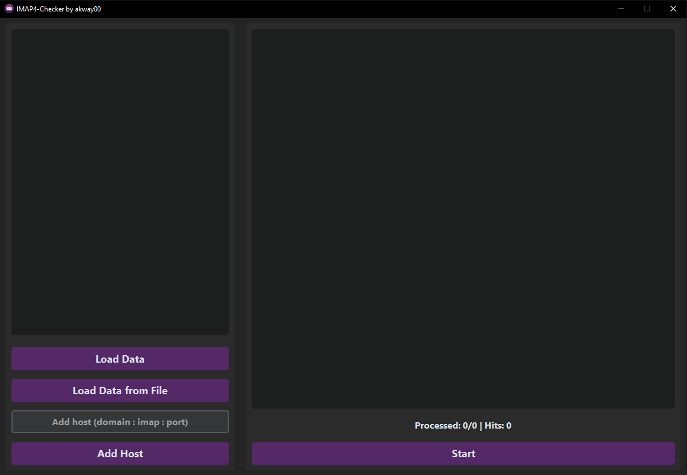
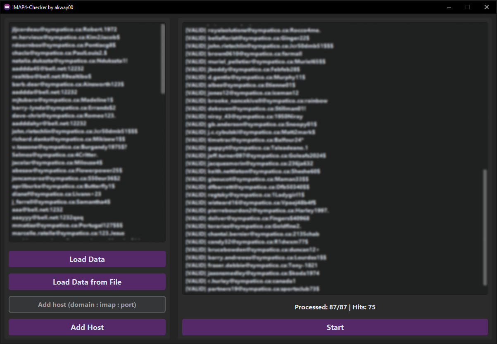

# IMAP4-Checker-UI

IMAP4-Checker-UI is a user-friendly application designed for validating email:password combinations using the IMAP4 protocol. With a sleek and simple interface, this tool allows you to load, validate, and save results efficiently. The application is distributed as a precompiled executable for easy usage.

---

## Screenshots

### Default State
Below is the interface of IMAP4-Checker-UI when it is first launched, in its default state:

### Running State
Here is the application in action, validating email:password combinations (blurred to ensure data privacy):

---

## Features

- **Load Email:Password Data**
  - Copy and paste a list of email:password combinations into the interface.
  - Load data directly from a `.txt` file.

- **Add IMAP Hosts**
  - Dynamically add new IMAP host configurations in the format: `domain:imap_server:port`.
  - Automatically save new hosts to the `hoster.dat` file for future use.

- **Real-Time Validation**
  - Validate email:password combinations using the IMAP4 protocol.
  - Results are displayed in real-time, with a clear distinction between valid and invalid combinations.

- **Save Results**
  - Valid email:password combinations are saved to an `output.txt` file for further use.

- **Progress Tracking**
  - Track the number of processed combinations and valid hits in real time.

- **Customizable Interface**
  - The interface is built with a modern and dark-themed design using `CustomTkinter`.

---

## How to Use

1. **Download and Extract**:
   - Download the provided `.zip` file from the repository's releases.
   - Extract it to your desired location.

2. **Run the Application**:
   - Double-click the `IMAP4-Checker-UI.exe` file to launch the application.

3. **Load Data**:
   - Paste your email:password list into the text box or use the "Load Data from File" button to import a `.txt` file.

4. **Add Hosts (Optional)**:
   - If needed, add custom IMAP configurations in the format `domain:imap_server:port` using the input field and "Add Host" button.

5. **Start Validation**:
   - Click the "Start" button to begin the validation process.
   - Valid results will be saved automatically to `output.txt`.

---

## Requirements

- The application is precompiled as an `.exe` and does not require Python to run.
- The following files must remain in the same directory as the `.exe`:
  - `hoster.dat`: Contains the IMAP host configurations.
  - `output.txt`: Where valid results will be saved.

---

## Notes

- This tool is distributed **without the source code**.
- Ensure that the `.exe` file and supporting files are kept together for the application to work correctly.
- For security and privacy reasons, the application does not log or share any email:password data.

---

## Disclaimer

This tool is provided for educational and legitimate testing purposes only. Misuse of this tool to access unauthorized accounts is strictly prohibited. The author does not hold responsibility for any inappropriate use of this software.

---

## License

This project is licensed under the MIT License. See the LICENSE file for more information.

## Author

Developed by akramway00.
